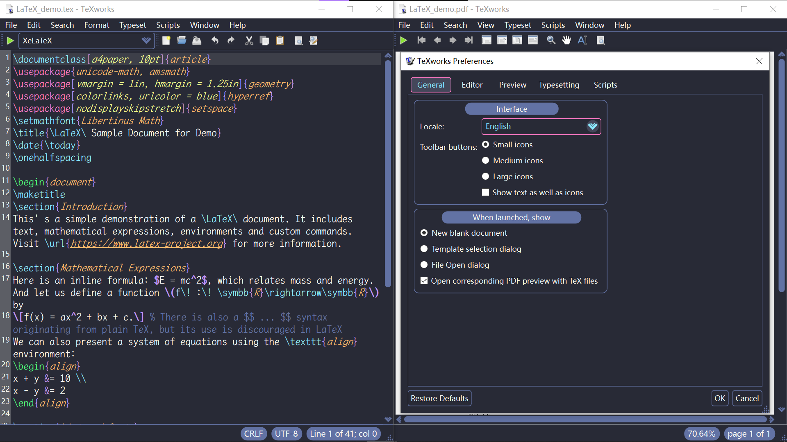

# Dracula for [TeXworks](https://tug.org/texworks/)

> A dark theme for [TeXworks](https://tug.org/texworks/).

> [!TIP]
> Only syntax highlighting effect applying to $\LaTeX$ documents is shown here. More images demonstrating for other document types can be found in the [`screenshots`](./screenshots) folder. They're just for display purposes and **do not represent** the grammatical correctness and compilability of the documents shown.

## Install

All instructions can be found at [`INSTALL.md`](./INSTALL.md).

> [!NOTE]
> This is an **unofficial** workaround for TeXworks theme, so it's suggested to read the [`NOTICE`](./NOTICE.md) file to learn more.

## Team

This theme is maintained by the following person(s) and a bunch of [awesome contributors](https://github.com/dracula/texworks/graphs/contributors).

|  |
| --- |
| [Wᴏɴɢ Chung](https://github.com/chataeseok) |

## Dracula PRO

## License

[GPL-3.0 License](./LICENSE)
